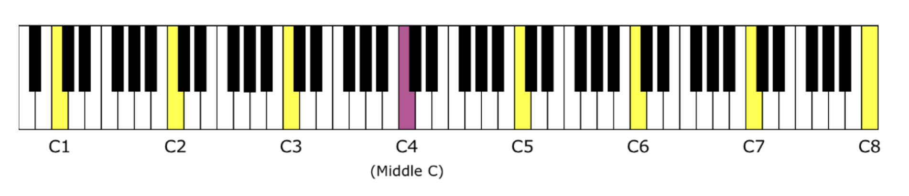
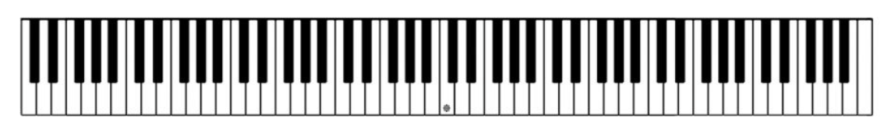

# pi_phd_hat
Source code for a python based PHD Hat

# Abit about Piano Music Therory: 
## The Piano Keyboard Layout: 

A standard Piano Keyboard has 88 keys with the following layout.

Our Midi Keyboard has 24 Keys (two full octaves) which can be mapped onto a larger 97 key keyboard by the use of the octave shift buttons. This results in the following layout. 

## The physics behind piano sounds:

The Keyboard of a Piano is comprised in the follwoing way:
- The Keyboard is devided into octaves: 
    - 12 Keys per Octave
    - 7 White Keys per Octave
    - 5 Black Keys per Octave

- Going up one key (= pressing the next right key white or black) is called doing a half half step.
- Two half steps make up a whole step.
- The white keys are named after the first 7 letters of the alphabet:
    - C, D, E, F, G, A, B
- The black keys are named after the white keys they are closest to:
    - Naming after the closest white key to the right is denoted as Sharp (#)
        - eg. C# is the black key to the right of C
    - Naming after the closest white key to the left is denoted as Flat (b)
        - eg. Db is the black key to the left of D
    

### Maping this to actual frequencies:

- Going up one octave doubles the frequency of the note. (eg. C3 of F#3 are twice the frequency of C2 and F#2)
- One frequency is manually tuned, for this a4 is set to 440Hz.
\section{Calculation of Note Frequencies}

The frequency of the other notes is calculated by the following formula:

\[
f(n) = a4 \cdot 2^{(n/12)}
\]

Where:
\begin{align*}
    &n \text{ is the number of half steps away from } a4 \text{ (positive or negative)} \\
    &f(n) \text{ is the frequency of the note } n \text{ half steps away from } a4 \\
    &a4 \text{ is the frequency of } a4 \text{ (440Hz)}
\end{align*}

We are using an **AKAI LPK25** Midi Keyboard which can be mapped onto a larger 97 key keyboard by the use of the octave shift buttons. This means the a4 key has the number 57. 